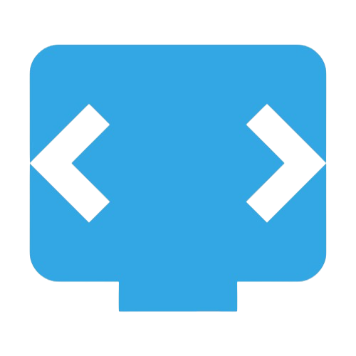
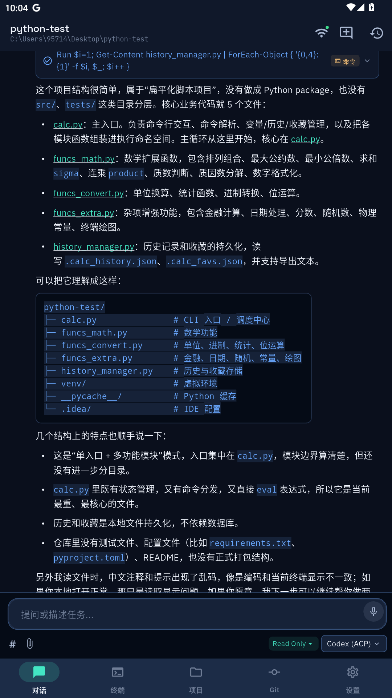
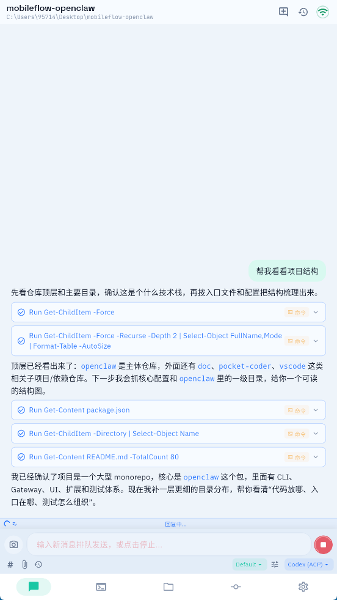
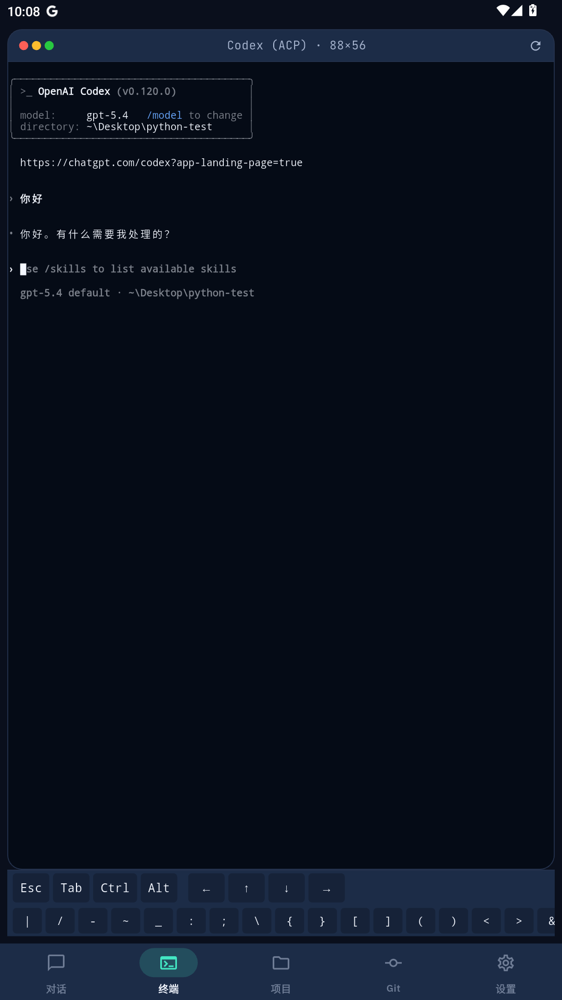
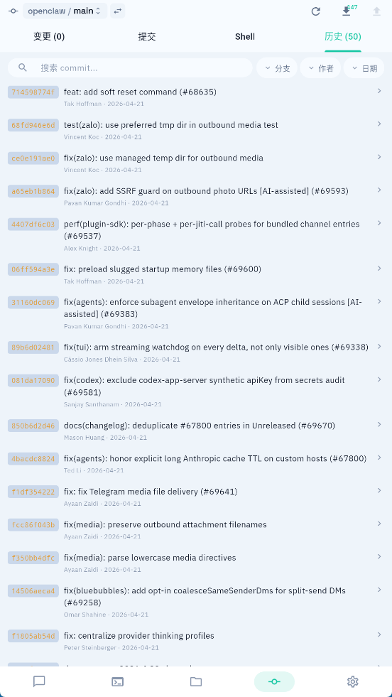
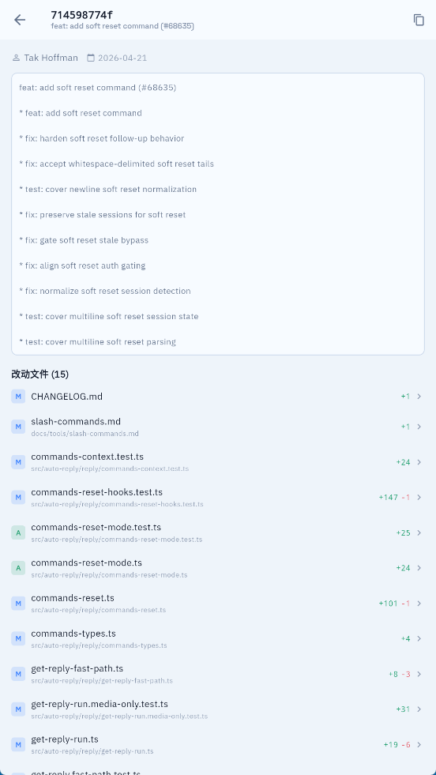
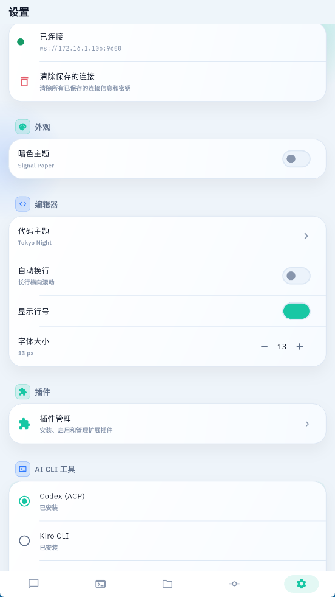
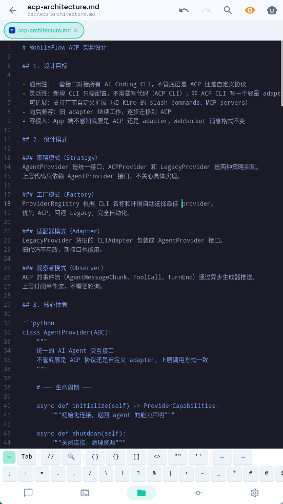

<p align="center">
  
</p>

<h1 align="center">MobileFlow</h1>

<p align="center">
  <strong>Your phone is now a coding terminal.<br/>Chat with AI, edit files, run commands, manage Git — all from your pocket.</strong>
</p>

<p align="center">
  <em>Mobile Remote for Desktop AI Coding Tools</em>
</p>

<p align="center">
  <a href="../../releases/latest"></a>
  <a href="../../releases/latest"></a>
  <a href="../../stargazers"></a>
</p>

<p align="center">
  <a href="../../releases/latest">⬇️ Download</a>&nbsp;&nbsp;•&nbsp;&nbsp;
  <a href="#-quick-start">🚀 Quick Start</a>&nbsp;&nbsp;•&nbsp;&nbsp;
  <a href="README.zh-CN.md">🇨🇳 中文</a>
</p>

---

## Why MobileFlow?

You're on the couch, in bed, or on the bus — and you want to check your code, ask AI a question, or push a quick fix. You don't want to open your laptop.

MobileFlow turns your phone into a remote control for your desktop AI coding tools. Your code never leaves your computer. The phone is just the screen.

## Screenshots

<table>
  <tr>
    <th>AI Chat</th>
    <th>Light Theme</th>
    <th>File Browser</th>
    <th>Terminal</th>
  </tr>
  <tr>
    <td></td>
    <td></td>
    <td></td>
    <td></td>
  </tr>
  <tr>
    <th>Git History</th>
    <th>Git Detail</th>
    <th>Settings</th>
    <th>File Editor</th>
  </tr>
  <tr>
    <td></td>
    <td></td>
    <td></td>
    <td></td>
  </tr>
</table>

## ✨ What You Can Do

- 🤖 **Chat with AI** — Claude Code, Codex, Gemini CLI, Kiro, Aider, and more
- 📁 **Browse & edit files** — syntax highlighting for 100+ languages
- 💻 **Full terminal** — run commands, see output, Ctrl+C to cancel
- 🔀 **Git everything** — diff, stage, commit, push, pull, switch branches
- 🔒 **End-to-end encrypted** — AES-256, your code stays on your machine
- 📡 **Works anywhere** — same WiFi, remote relay, or self-hosted tunnel

## 🚀 Quick Start

**3 steps, 2 minutes.**

**① Install Agent on your computer**

Download from [Releases](../../releases/latest) → run it → a tray icon appears with your IP and password.

**② Install App on your phone**

Download the APK from [Releases](../../releases/latest) → install → enter IP, port `9600`, and password.

**③ Install an AI tool**

```bash
npm i -g @anthropic-ai/claude-code    # or any AI CLI you prefer
```

That's it. Open the app, start chatting.

## 🏗️ How It Works

```
  📱 Phone                          💻 Computer
┌────────────┐   encrypted WS    ┌────────────────┐
│ Flutter    │◄──────────────────►│ Python Agent   │
│            │                    │                │
│ Chat UI    │                    │ AI CLI         │
│ Files      │                    │ File System    │
│ Terminal   │                    │ Terminal PTY   │
│ Git        │                    │ Git            │
└────────────┘                    └────────────────┘
```

The phone app is a thin UI layer — zero data storage. The Agent runs on your desktop, managing AI tools, files, and terminal sessions. All communication is encrypted.

## 🔐 Security

| | |
|---|---|
| 🔑 AES-256 encryption | Every message encrypted, even on LAN |
| 🚫 Zero third-party servers | Direct connection, your code never leaves your machine |
| 🛡️ Brute-force protection | 3 failed attempts → 60s lockout |
| 🎫 Session tokens | Password only used once during pairing |

## 📡 Connection Modes

| Mode | When to use | Latency |
|------|-------------|---------|
| **LAN** | Same WiFi | < 10ms |
| **Relay** | Different networks | ~50-100ms |
| **Tunnel** | Self-hosted server | Depends |

## Supported AI Tools

MobileFlow works with AI CLI tools that support the [ACP (Agent Client Protocol)](https://github.com/anthropics/agent-client-protocol). Currently supported:

Claude Code · Codex · Gemini CLI · Kiro · GitHub Copilot · Aider · Cline · and more

> 📖 Not on the same WiFi? See the [Remote Connection Guide](docs/remote-connection-guide.md) for relay and tunnel setup.

## 🤝 Feedback

Found a bug? Have a feature request? [Open an issue](../../issues) — we read every one.

---

<p align="center">
  <sub>Built with ❤️ for developers who code from anywhere.</sub>
</p>
