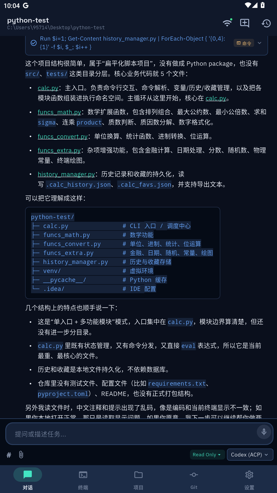
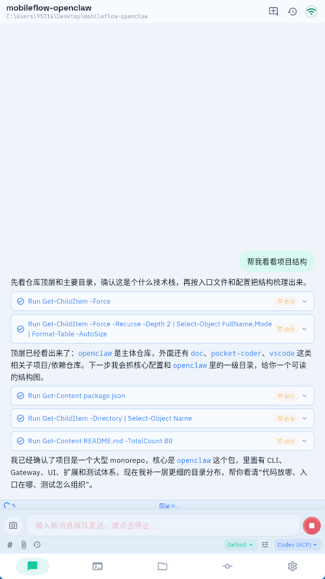
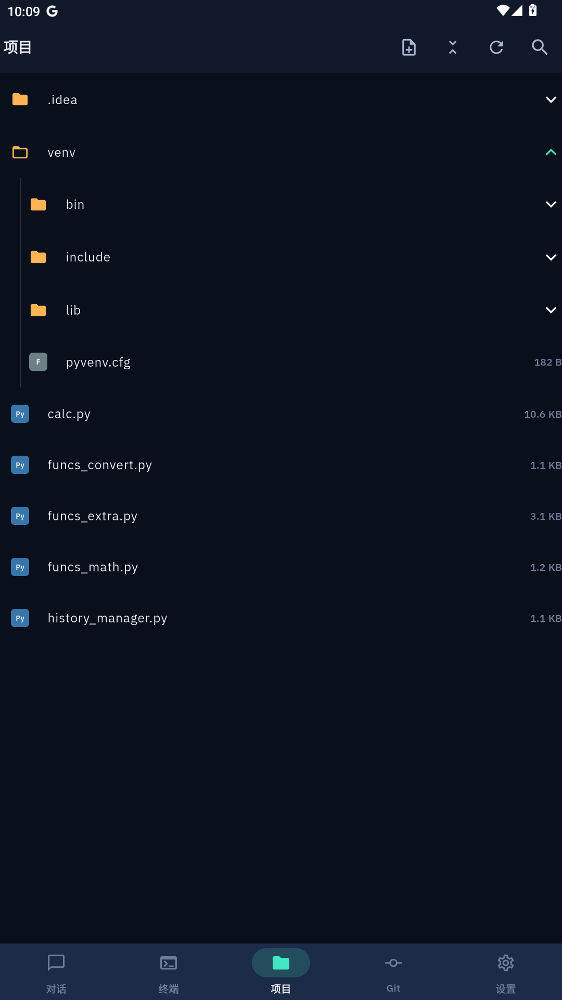
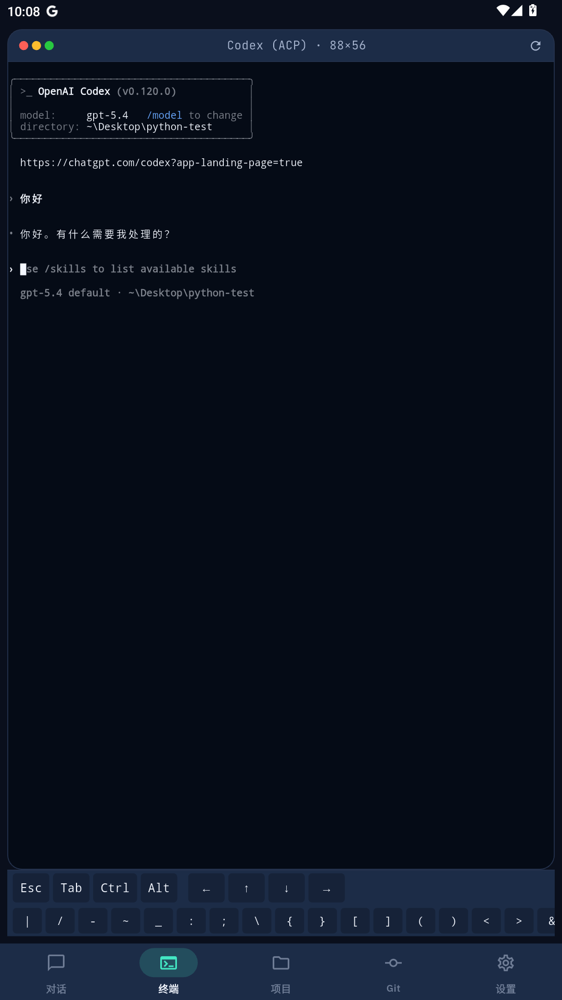
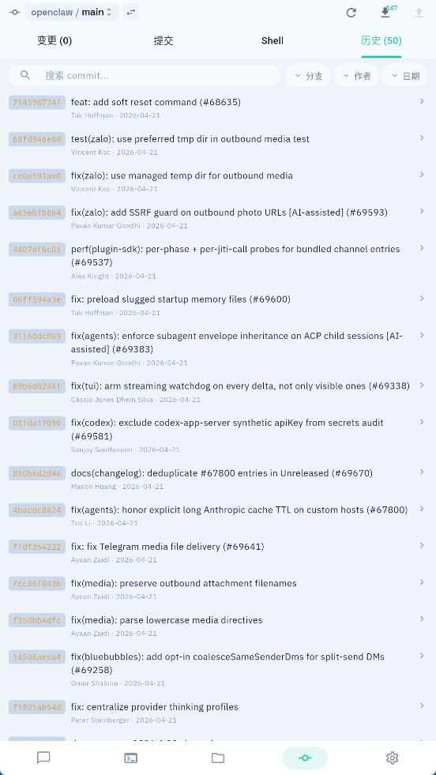
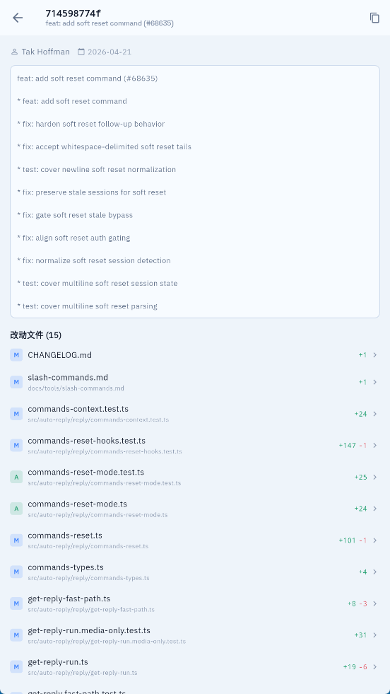
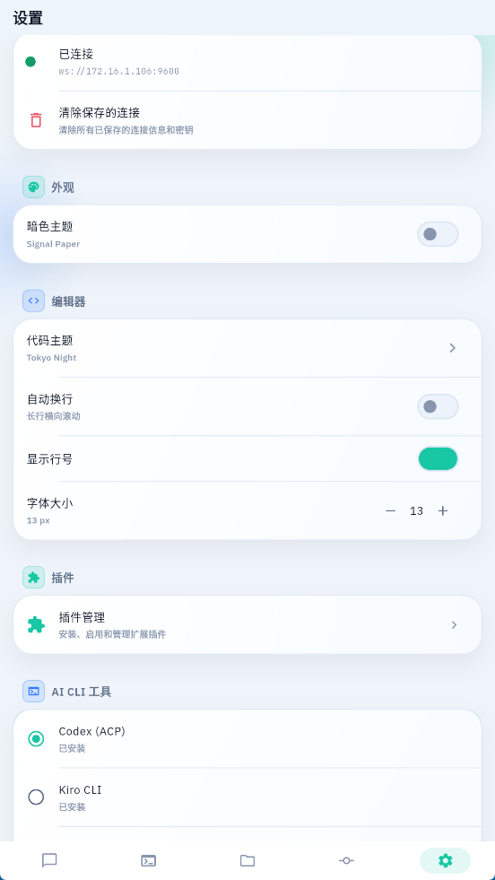
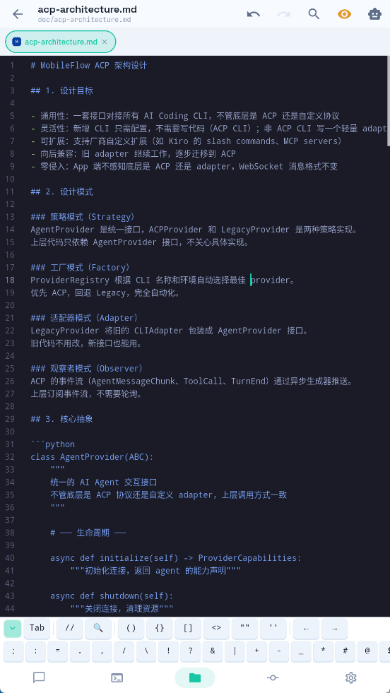

<p align="center">
  
</p>

<h1 align="center">MobileFlow</h1>

<p align="center">
  <strong>Control Claude Code, OpenAI Codex, Aider, Gemini CLI, GitHub Copilot and other AI coding agents from your phone.</strong>
</p>

<p align="center">
  MobileFlow is an open-source mobile remote coding client. It lets you chat with AI coding agents, browse files, run terminal commands, preview local web apps, and manage Git from your phone.
</p>

<p align="center">
  Your computer runs the coding tools. Your phone becomes the remote control.
</p>

<p align="center">
  <a href="../../releases/latest"></a>
  <a href="../../releases/latest"></a>
  <a href="../../stargazers"></a>
  <a href="LICENSE"></a>
</p>

<p align="center">
  <a href="../../releases/latest">⬇️ Download</a>&nbsp;&nbsp;•&nbsp;&nbsp;
  <a href="#-quick-start">🚀 Quick Start</a>&nbsp;&nbsp;•&nbsp;&nbsp;
  <a href="#supported-ai-coding-tools">🤖 Supported Tools</a>&nbsp;&nbsp;•&nbsp;&nbsp;
  <a href="#-connection-modes">📡 Connection Modes</a>&nbsp;&nbsp;•&nbsp;&nbsp;
  <a href="#faq">❓ FAQ</a>&nbsp;&nbsp;•&nbsp;&nbsp;
  <a href="README.zh-CN.md">🇨🇳 中文</a>
</p>

---

<!-- ## Demo: Control Claude Code from your phone -->
<!-- TODO: Add a 10-second GIF showing: connect → send task to Claude Code → see execution → view file changes → Git diff → commit -->

## Why MobileFlow?

You're on the couch, in bed, or on the bus — and you want to check your code, ask AI a question, or push a quick fix. You don't want to open your laptop.

MobileFlow turns your phone into a remote control for your desktop AI coding tools. Your code never leaves your computer. The phone is just the screen.

## Screenshots

<table>
  <tr>
    <th>AI Chat</th>
    <th>Light Theme</th>
    <th>File Browser</th>
    <th>Terminal</th>
  </tr>
  <tr>
    <td></td>
    <td></td>
    <td></td>
    <td></td>
  </tr>
  <tr>
    <th>Git History</th>
    <th>Git Detail</th>
    <th>Settings</th>
    <th>File Editor</th>
  </tr>
  <tr>
    <td></td>
    <td></td>
    <td></td>
    <td></td>
  </tr>
</table>

## Supported AI Coding Tools

| Tool | Status | Description |
|------|--------|-------------|
| Claude Code | ✅ Supported | Anthropic's AI coding agent |
| OpenAI Codex | ✅ Supported | OpenAI's coding CLI |
| Aider | ✅ Supported | Open-source AI pair programming |
| Gemini CLI | ✅ Supported | Google's AI coding tool (free tier) |
| GitHub Copilot | ✅ Supported | GitHub's AI assistant |
| Kiro CLI | ✅ Supported | AWS's AI coding agent |
| Local terminal tools | ✅ Supported | Any CLI tool on your computer |
| Cline | 🔜 Planned | VS Code AI extension |

All tools communicate via [ACP (Agent Client Protocol)](https://github.com/anthropics/agent-client-protocol).

## ✨ What You Can Do

### Use Claude Code from your phone

Chat with Claude Code running on your desktop. Send coding tasks, review changes, and approve file edits — all from your phone screen.

### Use OpenAI Codex from your phone

Control OpenAI Codex CLI remotely. Submit prompts, watch code generation, and manage your coding sessions on the go.

### Use Aider from your phone

Run Aider pair programming sessions from your phone. Add files to context, send instructions, and review AI-generated commits.

### Run terminal commands from your phone

Full terminal access with PTY support. Run builds, install packages, check logs, and Ctrl+C to cancel — just like sitting at your desk.

### Manage Git from your phone

View diffs, stage changes, commit, push, pull, switch branches, and browse commit history. Multi-repo support included.

### Preview local web apps on mobile

See your web app running on your desktop rendered on your phone screen. Test responsive layouts without deploying.

### All features at a glance

- 🤖 **Chat with AI** — Claude Code, Codex, Gemini CLI, Kiro, GitHub Copilot, Aider, and more
- 📁 **Browse & edit files** — syntax highlighting for 100+ languages, search
- 💻 **Full terminal** — run commands, see output, Ctrl+C to cancel
- 🔀 **Git everything** — diff, stage, commit, push, pull, switch branches, multi-repo
- 🖥️ **Live preview** — see your web app running on desktop, right on your phone
- ⚡ **Run configs** — launch, stop, and monitor dev servers remotely
- 🔌 **Slash commands** — CLI-advertised commands (/review, /compact) in chat menu
- 🔒 **End-to-end encrypted** — AES-256 / NaCl SecretBox, your code stays on your machine
- 📡 **Works anywhere** — same WiFi, remote relay, or self-hosted tunnel
- 🔄 **Session resume** — reconnect without losing AI conversation context

## 🚀 Quick Start

**3 steps, 2 minutes.**

**① Install Agent on your computer**

Download from [Releases](../../releases/latest) → run it → a tray icon appears with your IP and password.

| Platform | File |
|----------|------|
| Windows | `mobileflow-agent-windows.exe` |
| macOS | `mobileflow-agent-macos` |
| Linux | `mobileflow-agent-linux` |

Or run from source:
```bash
cd agent && pip install -e . && python -m mobileflow_agent
```

**② Install App on your phone**

Download the APK from [Releases](../../releases/latest) → install → enter IP, port `9600`, and password.

**③ Install an AI tool**

```bash
npm i -g @anthropic-ai/claude-code    # or any AI CLI you prefer
npm i -g @openai/codex                # OpenAI Codex
npm i -g @google/gemini-cli           # Gemini CLI (free tier)
pip install aider-chat                # Aider
```

That's it. Open the app, start chatting.

## 🏗️ How It Works

```
  📱 Phone                          💻 Computer
┌────────────┐   encrypted WS    ┌────────────────┐
│ Flutter    │◄──────────────────►│ Python Agent   │
│            │                    │                │
│ Chat UI    │                    │ AI CLI (ACP)   │
│ Files      │                    │ File System    │
│ Terminal   │                    │ Terminal PTY   │
│ Git        │                    │ Git            │
│ Preview    │                    │ Dev Server     │
└────────────┘                    └────────────────┘
```

The phone app is a thin UI layer — zero data storage. The Agent runs on your desktop, managing AI tools, files, and terminal sessions. All communication is encrypted via [ACP (Agent Client Protocol)](https://github.com/anthropics/agent-client-protocol).

## 🔐 Security

| | |
|---|---|
| 🔑 AES-256 / NaCl encryption | Every message encrypted, even on LAN |
| 🚫 Zero third-party servers | Direct connection, your code never leaves your machine |
| 🛡️ Brute-force protection | 3 failed attempts → 60s lockout |
| 🎫 Session tokens | Password only used once during pairing |
| 🔒 Tunnel mode | TLS + Bearer Token authentication |

## 📡 Connection Modes

| Mode | When to use | Security | Latency |
|------|-------------|----------|---------|
| **LAN** | Same WiFi | AES-256 after pairing | < 10ms |
| **Relay** | Different networks | E2E NaCl SecretBox | ~50-100ms |
| **Tunnel** | Self-hosted WSS | TLS + Bearer Token | Depends |

> 📖 Not on the same WiFi? See the [Remote Connection Guide](docs/remote-connection-guide.md) for relay and tunnel setup.

## 🛠️ Development

```bash
# Agent (Python 3.10+)
cd agent
pip install -e ".[dev]"
pytest

# App (Flutter 3.3+)
cd app
flutter pub get
flutter test
flutter run
```

## FAQ

### Can I use Claude Code from my phone?

Yes. MobileFlow lets you control Claude Code running on your computer from your phone. You get full chat, file browsing, and terminal access.

### Can I use OpenAI Codex from mobile?

Yes. MobileFlow supports remote control for OpenAI Codex CLI. Install Codex on your computer, and control it from your phone.

### Does MobileFlow support Aider?

Yes. MobileFlow supports Aider and other terminal-based AI coding tools. Any CLI tool that runs on your computer can be controlled from your phone.

### Is this a mobile IDE?

No. MobileFlow is not a mobile IDE. Your computer runs the coding tools, and your phone acts as a secure remote controller. Code never leaves your machine.

### Can I run terminal commands from my phone?

Yes. MobileFlow provides full PTY terminal access. Run any command, see real-time output, and use Ctrl+C to cancel — just like sitting at your desk.

### Can I manage Git from my phone?

Yes. You can view diffs, stage changes, commit, push, pull, switch branches, and browse commit history from your phone. Multi-repo support included.

### Is my code safe?

Yes. All communication is end-to-end encrypted (AES-256 / NaCl SecretBox). Your code stays on your computer. The phone is just a remote display. No third-party servers involved.

### What AI tools are supported?

Claude Code, OpenAI Codex, Aider, Gemini CLI, GitHub Copilot, Kiro CLI, and any terminal-based AI tool. MobileFlow uses the open ACP protocol, so new tools are easy to add.

## Keywords

Mobile coding, AI coding agent, Claude Code mobile, Codex mobile, Aider mobile, Gemini CLI mobile, GitHub Copilot mobile, remote coding, phone coding terminal, mobile developer tools, Git from phone, terminal from phone, vibe coding, mobile remote coding, AI pair programming mobile, coding from phone, remote development.

## 🤝 Contributing

Found a bug? Have a feature request? [Open an issue](../../issues) — we read every one.

Pull requests welcome! Please read the contributing guidelines first.

## License

[MIT](LICENSE)

---

<p align="center">
  <sub>Built with ❤️ for developers who code from anywhere.</sub>
</p>
